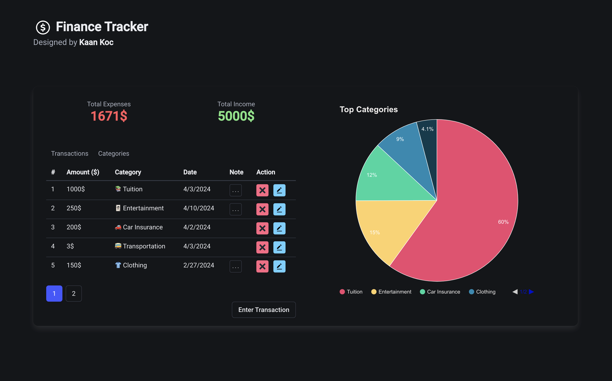

# Finance Tracking Website 💸

## Overview

This project is a finance tracking website developed using Angular and ASP.NET Core. It serves as a comprehensive tool for managing personal or business finances efficiently.

## Technologies Used
- **Frontend:** Angular, Bulma (CSS framework)
- **Backend:** ASP.NET Core
- **Database:** PostgreSQL
  
## Features

- **Category Management:** Create, read, update, and delete categories.
- **Transaction Management:** Create, read, update, and delete transactions.
- **Chart Visualization:** Visual representation of the most spent categories.
- **Responsive Design:** Ensures usability across desktop and mobile devices.
- **Integration:** Seamless integration of frontend and backend technologies.

## Challenges Overcome

Implementing Chart.js to display the most spent categories required integrating with Angular components and dynamically updating data based on transaction records.

## Future Enhancements

1. Implement additional financial metrics and forecasting tools.
2. Enhance user interface with more interactive elements.
3. Integrate third-party financial APIs for real-time data updates.
